# ESP32 Three-Phase AC Motor Control with SPWM

Three-phase AC motor control system implemented on ESP32 using Sinusoidal PWM (SPWM) modulation. The firmware supports multiple operation modes for different use cases: Python debugging, Simulink integration, and plant modeling with internal ramp generation.

---

## 📋 Table of Contents

1. [Operation Modes](#operation-modes)
2. [System Architecture](#system-architecture)
3. [UART Communication Protocols](#uart-communication-protocols)
4. [Encoder System](#encoder-system)
5. [FreeRTOS Tasks](#freertos-tasks)
6. [Hardware Configuration](#hardware-configuration)
7. [Usage Examples](#usage-examples)

---

## 🎛️ Operation Modes

The system supports **three operation modes** configurable via defines in `app_main.cpp`:

### Mode 1: Python Debug (`PYTHON_DEBUG = 1`)

**Purpose:** Debugging and manual control via text commands from Python.

**Features:**
- UART communication using readable ASCII commands
- Interactive control of frequency, amplitude, and RPM reference
- Ideal for testing and development
- Uses `demo_cli.py` script for interactive interface

**Configuration:**
```cpp
#define PYTHON_DEBUG 1
#define PLANT_MODELING 0
#define INTERNAL_RAMP 0
```

**Protocol:** Text commands like `SET CH1 60` (see UART Protocols section)

**Active Task:** `uart_rx_task` - Processes ASCII text commands

---

### Mode 2: Simulink (`PYTHON_DEBUG = 0`, `INTERNAL_RAMP = 0`)

**Purpose:** Integration with Simulink for closed-loop control.

**Features:**
- High-speed binary communication
- Receives: `[rpm_ref, freq]` as two `int16_t` (4 bytes total)
- Sends: `[rpm_ref, rpm_measured]` as two `int16_t` (4 bytes total)
- Sampling period: 10ms (configurable with `SAMPLE_MS`)
- Ideal for PID controller implementation in Simulink

**Configuration:**
```cpp
#define PYTHON_DEBUG 0
#define PLANT_MODELING 0
#define INTERNAL_RAMP 0
```

**Protocol:** Binary (see UART Protocols section)

**Active Tasks:**
- `simulink_rx_task` - Receives binary commands from Simulink
- `rpm_tx_task` - Sends RPM data to Simulink

---

### Mode 3: Plant Modeling (`PLANT_MODELING = 1`, `INTERNAL_RAMP = 1`)

**Purpose:** Data capture for plant identification (motor system modeling).

**Features:**
- Generates automatic frequency ramp (no PC needed)
- Configurable range: 20 Hz → 50 Hz in 60 seconds (default)
- CSV format output: `Time(s), Frequency(Hz), RPM`
- Sampling period: 100ms (for cleaner data)
- Waits 3 seconds after boot before starting ramp
- Maintains final frequency for 10 additional seconds

**Configuration:**
```cpp
#define PYTHON_DEBUG 0
#define PLANT_MODELING 1
#define INTERNAL_RAMP 1
```

**Configurable ramp parameters:**
```cpp
#define RAMP_START_HZ 20.0f    // Initial frequency
#define RAMP_END_HZ 50.0f      // Final frequency
#define RAMP_DURATION_S 60.0f  // Ramp duration
```

**CSV Output:**
```
Time(s),Frequency(Hz),RPM
0.00,20.00,1245.67
0.10,20.05,1248.23
0.20,20.10,1250.89
...
```

**Active Task:** `ramp_generator_task` - Generates automatic frequency ramp

---

## 🏗️ System Architecture

### Main Components

```mermaid
graph TB
    UART[UART RX Task] -->|Commands| QUEUE[Command Queues]
    QUEUE --> PWM_A[PWM Task A - Phase 0°]
    QUEUE --> PWM_B[PWM Task B - Phase 120°]
    QUEUE --> PWM_C[PWM Task C - Phase 240°]
    
    TIMER[Hardware Timer ISR] -->|Notification| PWM_A
    TIMER -->|Notification| PWM_B
    TIMER -->|Notification| PWM_C
    
    ENC_A[Encoder Pin A] -->|ISR| ENC_ISR[Encoder ISR]
    ENC_B[Encoder Pin B] -->|ISR| ENC_ISR
    ENC_ISR -->|Pulses| RPM_TASK[RPM TX Task]
    
    RPM_TASK -->|Telemetry| UART_OUT[UART TX]
    
    PWM_A --> MOTOR[Three-Phase AC Motor]
    PWM_B --> MOTOR
    PWM_C --> MOTOR
```



### SPWM Generation

The system generates three sinusoidal PWM signals phase-shifted by 120° from each other:

1. **Phase A (0°):** Reference signal
2. **Phase B (+120°):** Positive 120° phase shift
3. **Phase C (+240°):** Positive 240° phase shift (equivalent to -120°)

Each phase uses:
- **Lookup Table (LUT)** high-resolution sinusoidal
- **PWM Modulation** at fixed frequency (typically 20 kHz)
- **Dead-time** configurable (500 ns default) for driver protection

---

## 📡 UART Communication Protocols

### UART Configuration

| Parameter | Value |
|-----------|-------|
| Baud Rate | 115200 |
| Data Bits | 8 |
| Parity | None |
| Stop Bits | 1 |
| Flow Control | None |

---

### Protocol 1: Text Commands (Python Debug)

**General Format:**
```
SET [CHANNEL] [VALUE_LIST]
```

**Available Channels:**

| Channel | Function | Range | Unit |
|---------|----------|-------|------|
| `CH1` | Global frequency | 0-60 | Hz |
| `CH2` | Global amplitude | 0-100 | % |
| `CH3` | Reference RPM | 0-10000 | RPM |

**Command Examples:**

```bash
# Simple command - set frequency to 60 Hz
SET CH1 60

# Simple command - set amplitude to 100%
SET CH2 100

# Simple command - set reference RPM to 3600
SET CH3 3600

# Sequence - frequency ramp
SET CH1 10,20,30,40,50,0

# Sequence - amplitude ramp
SET CH2 0,25,50,75,100
```

**Sequence Processing:**

When a sequence is sent (comma-separated values), the system:

1. **Parses** all values in the `uart_rx_task` task
2. **Packs** the values into a `seq_t` structure
3. **Enqueues** the complete sequence using `xQueueOverwrite()`
4. **Executes** each value with an interval of `T_PULSE_MS` (250ms default)

**Sequence Structure:**
```cpp
typedef struct {
    uint8_t len;                    // Number of values
    uint32_t vals[MAX_SEQ_LEN];     // Array of values (max 16)
} seq_t;
```

---

### Protocol 2: Binary (Simulink)

**Direction: PC → ESP32**

| Byte | Content | Type |
|------|---------|------|
| 0-1 | RPM Reference | `int16_t` (little-endian) |
| 2-3 | Frequency (Hz) | `int16_t` (little-endian) |

**Total:** 4 bytes per packet

**Direction: ESP32 → PC**

| Byte | Content | Type |
|------|---------|------|
| 0-1 | RPM Reference | `int16_t` (little-endian) |
| 2-3 | RPM Measured | `int16_t` (little-endian) |

**Total:** 4 bytes per packet

**Python Example:**
```python
import struct
import serial

ser = serial.Serial('/dev/ttyUSB0', 115200)

# Send: rpm_ref=3000, freq=50
data = struct.pack('<hh', 3000, 50)
ser.write(data)

# Receive: rpm_ref, rpm_measured
response = ser.read(4)
rpm_ref, rpm_measured = struct.unpack('<hh', response)
```

---

### Protocol 3: CSV (Plant Modeling)

**Output Format:**
```
Time(s),Frequency(Hz),RPM
```

**Features:**
- Sampling period: 100ms (configurable with `SAMPLE_MS`)
- Output via `stdout` (UART)
- Ready to import in MATLAB/Python for system identification

**Capture Example:**
```bash
# Capture data to CSV file
python3 -c "import serial; s=serial.Serial('/dev/ttyUSB0',115200); 
[print(s.readline().decode().strip()) for _ in range(1000)]" > plant_data.csv
```

---

## 🔄 Encoder System

### Specifications

| Parameter | Value |
|-----------|-------|
| Type | Incremental quadrature encoder |
| Pins | GPIO 16 (A), GPIO 17 (B) |
| Method | QEM (Quadrature Encoder Method) |
| Resolution | 4x decoding |
| PPR | 199 pulses per revolution |
| Pull-up | Internally enabled |

### 4x Decoding Method (QEM)

The system uses **4x decoding** via the QEM method, which detects **all edges** (rising and falling) of **both signals** (A and B).

**Advantages:**
- Maximum resolution: 4 × PPR = 796 transitions per revolution
- Automatic direction detection
- Higher precision at low speeds

**QEM Lookup Table:**
```cpp
// Index: [old_B][old_A][new_B][new_A]
// Value: increment (-1, 0, +1)
static const int8_t QEM[16] = {
    0, -1,  1,  0,
    1,  0,  0, -1,
   -1,  0,  0,  1,
    0,  1, -1,  0
};
```

### RPM Calculation

**Formula:**
```
cycles = pulses / 8.0          // 4x decoding → 8 transitions per cycle
revolutions = cycles / PPR
RPM = (revolutions / SAMPLE_MS) × 60000
```

**Filtering:**
- EMA filter (Exponential Moving Average)
- Coefficient α = 0.1 (configurable)
- Formula: `RPM_filtered = α × RPM_raw + (1-α) × RPM_filtered_prev`

**Encoder ISR:**
```cpp
static void IRAM_ATTR encoder_isr(void *arg) {
    uint32_t gpio_in = GPIO.in;              // Direct register read
    g_old_AB <<= 2;                          // Shift previous state
    uint8_t new_AB = ((gpio_in >> PIN_ENC_A) & 1) << 1 | 
                     ((gpio_in >> PIN_ENC_B) & 1);
    g_old_AB |= new_AB;
    g_pulse_count += QEM[g_old_AB & 0x0f];   // Lookup table
}
```

---

## 🧵 FreeRTOS Tasks

### Task Summary

| Task | Priority | Core | Function |
|------|----------|------|----------|
| `uart_rx_task` | 5 | 0 | Receives text commands (Python Debug) |
| `simulink_rx_task` | 5 | 0 | Receives binary commands (Simulink) |
| `ramp_generator_task` | 5 | 0 | Generates internal ramp (Plant Modeling) |
| `rpm_tx_task` | 5 | 0 | Calculates and transmits RPM |
| `pwm_task` (×3) | 5 | 1 | Generates SPWM signals for each phase |

---

### Task: `uart_rx_task` (Python Debug Mode)

**Purpose:** Process ASCII text commands from UART.

**Operation:**
1. Reads bytes from UART with 200ms timeout
2. Accumulates data in line buffer
3. When `\n` is detected, processes complete command
4. Parses `SET [CHANNEL] [VALUE_LIST]` format
5. Splits values by commas if sequence
6. Packs into `seq_t` structure
7. Sends to corresponding queue (`cmdQueueA/B/C`)

**Command Queues:**
- `cmdQueueA` → CH1 (Frequency)
- `cmdQueueB` → CH2 (Amplitude)
- `cmdQueueC` → CH3 (RPM Reference)

---

### Task: `simulink_rx_task` (Simulink Mode)

**Purpose:** Receive binary commands from Simulink.

**Operation:**
1. Reads bytes from UART
2. Accumulates in 4-byte buffer
3. When 4 bytes complete:
   - Extracts `rpm_ref` (bytes 0-1)
   - Extracts `freq` (bytes 2-3)
   - Updates global variables
   - Calls `phases::set_frequency(freq)`
4. Resets buffer and waits for next packet

**Data Format:**
```cpp
int16_t rpm_ref = (buffer[0] | (buffer[1] << 8));
int16_t freq = (buffer[2] | (buffer[3] << 8));
```

---

### Task: `ramp_generator_task` (Plant Modeling Mode)

**Purpose:** Generate automatic frequency ramp for plant modeling.

**Operation:**
1. Waits 3 seconds after boot
2. Initializes frequency to `RAMP_START_HZ`
3. Every 100ms:
   - Calculates new frequency: `freq = START + (SLOPE × time)`
   - Updates `g_current_freq`
   - Calls `phases::set_frequency(freq)`
4. Upon reaching `RAMP_END_HZ`, maintains frequency for 10s
5. Then maintains indefinitely at final frequency

**Parameters:**
```cpp
#define RAMP_START_HZ 20.0f
#define RAMP_END_HZ 50.0f
#define RAMP_DURATION_S 60.0f
#define RAMP_SLOPE ((RAMP_END_HZ - RAMP_START_HZ) / RAMP_DURATION_S)
```

---

### Task: `rpm_tx_task`

**Purpose:** Measure encoder RPM and transmit data.

**Operation:**
1. Waits `SAMPLE_MS` (10ms or 100ms depending on mode)
2. Reads and resets `g_pulse_count` (critical section)
3. Calculates RPM using 4x decoding method
4. Applies EMA filter
5. **Normal Mode:** Sends `[rpm_ref, rpm_measured]` binary
6. **Plant Modeling Mode:** Prints CSV `Time,Freq,RPM`

**Critical Section:**
```cpp
portDISABLE_INTERRUPTS();
pulses = g_pulse_count;
g_pulse_count = 0;
portENABLE_INTERRUPTS();
```

---

### Task: `pwm_task` (×3 instances)

**Purpose:** Generate SPWM signal for each motor phase.

**Instances:**
- **pwmA:** Phase A (0°) - Core 1
- **pwmB:** Phase B (+120°) - Core 1
- **pwmC:** Phase C (+240°) - Core 1

**Operation:**
1. **Initialization:**
   - Configures timer and PWM pins
   - Sets dead-time (500ns)
   - Calculates phase shift (`shift_int`)

2. **Main Loop:**
   - Checks command queue (non-blocking)
   - If sequence exists, executes values with delay
   - Waits for timer notification (`ulTaskNotifyTake`)
   - Calculates angle with shift: `theta_shifted = theta + shift_int`
   - Gets sinusoidal value from LUT
   - Applies global amplitude
   - Updates PWM duty cycle

**Phase Shifts:**
```cpp
constexpr uint32_t PLS_M_TAU_3_INT = phases::MAX_THETA_INT / 3u;  // +120°
constexpr uint32_t MNS_M_TAU_3_INT = (~PLS_M_TAU_3_INT) + 1u;     // +240°
```

**Notification from ISR:**
```cpp
void phases_notify_pwm_tasks_from_isr(void) {
    vTaskNotifyGiveFromISR(pwmA_task_handle, &xHigherPriorityTaskWoken);
    vTaskNotifyGiveFromISR(pwmB_task_handle, &xHigherPriorityTaskWoken);
    vTaskNotifyGiveFromISR(pwmC_task_handle, &xHigherPriorityTaskWoken);
    portYIELD_FROM_ISR(xHigherPriorityTaskWoken);
}
```

---

## 🔌 Hardware Configuration

### Motor Pins (SPWM)

| Phase | Pin High | Pin Low | Function |
|-------|----------|---------|----------|
| A | `phases::A_HIGH_GPIO` | `phases::A_LOW_GPIO` | Phase 0° |
| B | `phases::B_HIGH_GPIO` | `phases::B_LOW_GPIO` | Phase +120° |
| C | `phases::C_HIGH_GPIO` | `phases::C_LOW_GPIO` | Phase +240° |

### Encoder Pins

| Signal | GPIO | Configuration |
|--------|------|---------------|
| Encoder A | GPIO 16 | Input, Pull-up, Interrupt ANY_EDGE |
| Encoder B | GPIO 17 | Input, Pull-up, Interrupt ANY_EDGE |

### Enable Pin

| Pin | GPIO | State |
|-----|------|-------|
| ENABLE | GPIO 23 | LOW (motor enabled) |

---

## 📚 Usage Examples

### Example 1: Manual Control with Python

```python
# demo_cli.py - Interactive interface
python3 demo_cli.py /dev/ttyUSB0

# Select channel and send commands
# Option 1: CH1 (Frequency)
# Values: 60
# → Motor runs at 60 Hz

# Option 2: CH2 (Amplitude)
# Values: 50
# → Amplitude reduced to 50%
```

### Example 2: Frequency Sequence

```python
import serial

ser = serial.Serial('/dev/ttyUSB0', 115200)

# Frequency ramp: 10→20→30→40→50 Hz
# Each value held for 250ms
ser.write(b'SET CH1 10,20,30,40,50\n')
```

### Example 3: Simulink Integration

**Firmware Configuration:**
```cpp
#define PYTHON_DEBUG 0
#define PLANT_MODELING 0
#define INTERNAL_RAMP 0
```

**Simulink Code (S-Function):**
```c
// Send: rpm_ref=3000, freq=45
int16_t tx_data[2] = {3000, 45};
serial_write(tx_data, 4);

// Receive: rpm_ref, rpm_measured
int16_t rx_data[2];
serial_read(rx_data, 4);
int16_t rpm_measured = rx_data[1];
```

### Example 4: Data Capture for Modeling

**Firmware Configuration:**
```cpp
#define PYTHON_DEBUG 0
#define PLANT_MODELING 1
#define INTERNAL_RAMP 1
```

**Capture Script:**
```python
import serial
import csv

ser = serial.Serial('/dev/ttyUSB0', 115200, timeout=1)

with open('plant_data.csv', 'w', newline='') as f:
    writer = csv.writer(f)
    
    # Read header
    header = ser.readline().decode().strip()
    writer.writerow(header.split(','))
    
    # Capture 70 seconds of data (60s ramp + 10s steady-state)
    for _ in range(700):  # 100ms per sample
        line = ser.readline().decode().strip()
        if line:
            writer.writerow(line.split(','))
            print(line)

print("Data captured in plant_data.csv")
```

**MATLAB Analysis:**
```matlab
% Load data
data = readtable('plant_data.csv');

% Plot response
figure;
subplot(2,1,1);
plot(data.Time_s_, data.Frequency_Hz_);
xlabel('Time (s)'); ylabel('Frequency (Hz)');
title('Input: Frequency Ramp');

subplot(2,1,2);
plot(data.Time_s_, data.RPM);
xlabel('Time (s)'); ylabel('RPM');
title('Output: Measured RPM');

% System identification
sys = tfest(data, 2, 1);  % 2nd order system
```

---

## 🔧 Configuration and Compilation

### Requirements

- **ESP-IDF v4.4 or earlier** (MCPWM Legacy API not available in v5.0+)
- Python 3.7+ (for interface scripts)
- pyserial (`pip install pyserial`)

> [!IMPORTANT]
> This project uses the MCPWM Legacy API which is only available in ESP-IDF v4.4 and earlier versions. ESP-IDF v5.0+ uses a completely different MCPWM API that is incompatible with this code.

### Compilation

```bash
# Configure project
idf.py menuconfig

# Build
idf.py build

# Flash
idf.py -p /dev/ttyUSB0 flash

# Serial monitor
idf.py -p /dev/ttyUSB0 monitor
```

---

## 📊 Configurable Parameters

### Encoder

```cpp
#define PPR 199.0f              // Pulses per revolution
#define ALPHA 0.1f              // EMA filter coefficient (0-1)
#define SAMPLE_MS 10            // RPM sampling period (ms)
```

### Internal Ramp

```cpp
#define RAMP_START_HZ 20.0f     // Initial frequency (Hz)
#define RAMP_END_HZ 50.0f       // Final frequency (Hz)
#define RAMP_DURATION_S 60.0f   // Ramp duration (s)
```

### Sequences

```cpp
#define T_PULSE_MS 250          // Interval between values (ms)
```

### PWM

```cpp
// In phases.hpp/cpp
#define PWM_FREQUENCY 20000     // PWM frequency (Hz)
#define DEAD_TIME_NS 500        // Dead-time (ns)
```

---